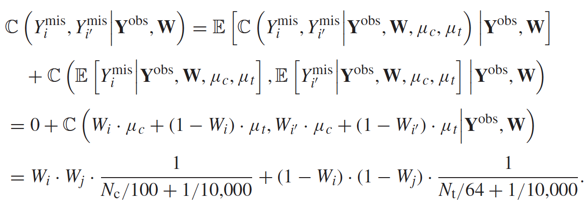
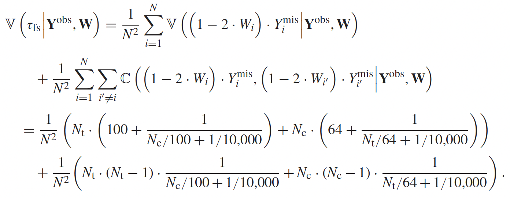

<!-- _class: lead -->
## Bayesian AB テスト入門 (モデルベースABテスト入門)
こっしー

---
# 参考文献

右の本の 8 章をがっつり転載します。

Rubin 大先生が著者の1人の本。
**Causal Inference For Statistics, Social, And Biomedical Sciences**

---
# 対象者
- 因果推論の手法（の一つ）、潜在的結果変数フレームワークをぼんやり理解している人。
- 具体的には、因果効果とは $\mathrm{Y}_i(1) - \mathrm{Y}_i(0)$ で定義できることを何となく知っていたり、ATE という言葉に聞き馴染みがある人。
- ベイズを知っている人。事後予測分布と言われて思い当たる人。
- ベイズを知らなくても、聞き流せる人。

---
# 目標

## モデルベースな AB テストの簡易的な実装方法を知る

---
# 目次

1. 因果推論の根本問題の単純な解決策 
2. $\mathrm{Y}^{mis}$ の条件付き分布が知りたい
3. 4 ステップで ATE 推測
4. 具体例
5. シミュレーションベースで再計算
6. 潜在的結果変数に従属関係があった場合
7. 無限超母集団における ATE の推測
8. 実データで求めてみよう

---
# 1. 単純な解決策

- ある就職支援プログラムを行なった。
- $\mathrm{Y}_i(0)$ はプログラム非参加後の収入
- $\mathrm{Y}_i(1)$ はプログラム参加後の収入
- $\mathrm{W}_i$ はプログラムに参加したかを表す処置割り付け変数
- $\mathrm{Y}_i^{obs}$ は観測した収入
- 因果効果 ($\mathrm{Y}_i(1) - \mathrm{Y}_i(0)$) が ? のせいで分からない = **因果推論の根本問題**
---
# 1. 単純な解決策
- もし $?\hspace{1mm}(=\mathrm{Y}_i^{mis})$ が分かるとしたら、以下の式で簡単に ATE $\tau_{\mathrm{fs}}$ は分かる。
$$\begin{align}
\tau_{\mathrm{fs}} & = \tilde{\tau}(\mathbf{Y}^{obs}, \mathbf{Y}^{mis}, \mathbf{W}) \\
& = \frac{1}{6} \cdot \sum_{i=1}^N((\mathrm{W}_i\cdot\mathrm{Y}_i^{obs} + (1 - \mathrm{W}_i)\cdot\mathrm{Y}_i^{mis}) \quad \\
& \qquad - \quad ((1 - \mathrm{W}_i)\cdot\mathrm{Y}_i^{obs} + \mathrm{W}_i \cdot \mathrm{Y}_i^{mis})   ) \\
& = \frac{1}{6}\cdot \sum_{i=1}^N ((2\cdot \mathrm{W}_i - 1) \cdot (\mathrm{Y}_i^{obs} - \mathrm{Y}_i^{mis}))
\end{align}$$

---
# 1. 単純な解決策

- なら $\mathrm{Y}_i^{mis}$ を埋めればいいでしょ?
- --> 各群の観測値の平均で $\mathrm{Y}_i^{mis}$ を埋めちゃおう $(= \hat{\mathrm{Y}}_i^{mis})$
$$\begin{align}
\hat{\tau} & = \tilde{\tau}(\mathbf{Y}^{obs}, \hat{\mathbf{Y}}^{mis}, \mathbf{W}) \\
& = \frac{1}{6}\cdot \sum_{i=1}^N ((2\cdot \mathrm{W}_i - 1) \cdot (\mathrm{Y}_i^{obs} - \hat{\mathrm{Y}}_i^{mis}))
\end{align}$$
- この $\hat{\tau}$ は、$\bar{\mathrm{Y}}_t^{obs} - \bar{\mathrm{Y}}_c^{obs}$ に等しい。

---
# 1. 単純な解決策

問題点
- 一点のみの点推定しか分からず、不確実性を測れない
- $\mathrm{Y}_2^{mis}, \mathrm{Y}_4^{mis}, \mathrm{Y}_6^{mis}$ が全部 $4.13$ に一致するわけがない
  - $\mathrm{Y}_1^{mis}, \mathrm{Y}_3^{mis}, \mathrm{Y}_5^{mis} = 12.8$ もあり得ない
- --> $\mathrm{Y}_i^{mis}$ の推定に変動がほしい
- --> **$\mathrm{Y}_i^{mis}$ の分布が知りたい**
---
# 1. 単純な解決策
解決策2

- $\mathrm{Y}_i^{obs}$ からランダムに選ぶ。
- $\mathrm{ATE} = 4.1, 10.7$ --> バラついた!
- 右記 2 通りのように、全ての組み合わせ $3^6 = 729$ 通りの $\mathrm{ATE}$ 全てを平均すると、　　$\hat{\tau}^{\mathrm{dif}}　＝\bar{\mathrm{Y}}_t^{obs} - \bar{\mathrm{Y}}_c^{obs}$ に等しくなる。
- $729$ 通りの $\mathrm{ATE}$ を用いれば、$\mathrm{ATE}$ の標準偏差が算出できる。
---
# 1. 単純な解決策
問題点
- 6 以上のサンプルサイズだと、全通り計算するにはコストが高すぎる。
  - $3^n$ のオーダーで計算量が増えていく
- 限られたサンプルからランダム抽出すると不確実性を十分に考慮できない。
  - 上の例だと、$\mathrm{Y}_2^{mis}, \mathrm{Y}_4^{mis}, \mathrm{Y}_6^{mis}$ のみからランダム抽出するのでは、現実を反映しきれなかった。
  - --> 現実の値が $\mathrm{Y}_2^{mis}, \mathrm{Y}_4^{mis}, \mathrm{Y}_6^{mis}$ のどれかに必ずなるわけがない

---
# 1. 単純な解決策
- どうすればより柔軟に $\mathrm{Y}_i^{mis}$ の不確実性を知れるのか
- **--> 観測値で条件付けた $\mathrm{Y}_i^{mis}$ の分布を知る**
- **--> ベイズ！**
---
# 目次

1. 因果推論の根本問題の単純な解決策 
2. **$\mathrm{Y}^{mis}$ の条件付き分布が知りたい**
3. 4 ステップで ATE 推測
4. 具体例
5. シミュレーションベースで再計算
6. 潜在的結果変数に従属関係があった場合
7. 無限超母集団における ATE の推測
8. 実データで求めてみよう
---
# 2. $\mathrm{Y}^{mis}$ の条件付き分布
- このベイジアンアプローチのゴールは、以下をモデル化すること
$$f(\mathbf{Y}^{mis} | \mathbf{Y}^{obs}, \mathbf{W}).$$
- --> これさえ分かれば、処置効果でも、各群における潜在的変数の分散比でも、 導出できる！

---
# 2. $\mathrm{Y}^{mis}$ の条件付き分布
1.で挙げた一つ目の例を確率分布で表現するなら
$$\begin{equation}
\mathrm{Pr}(\mathrm{Y}_i^{mis} = \mathrm{y}|\mathbf{Y}^{obs}, \mathbf{W})= \left \{
\begin{array}{l}
1\qquad\mathrm{if}\quad \mathrm{y}＝12.8, \quad\mathrm{and} \quad W_i=0, \\
1\qquad\mathrm{if}\quad \mathrm{y}＝4.1, \quad\mathrm{and} \quad W_i=1, \\
0\qquadそれ以外のとき
\end{array}
\right.
\end{equation}$$
二つ目の例は
$$\begin{equation}
\mathrm{Pr}(\mathrm{Y}_i^{mis} = \mathrm{y}|\mathbf{Y}^{obs}, \mathbf{W})= \left \{
\begin{array}{l}
1/3\qquad\mathrm{if}\quad \mathrm{y}\in \{3.6, 9.9, 24.9\}, \quad\mathrm{and} \quad W_i=0, \\
1/3\qquad\mathrm{if}\quad \mathrm{y}＝12.4, \quad\mathrm{and} \quad W_i=1, \\
2/3\qquad\mathrm{if} \quad \mathrm{y}=0, \quad \mathrm{and} \quad W_i=1,\\
0\qquadそれ以外のとき
\end{array}
\right.
\end{equation}$$
---
# 2. $\mathrm{Y}^{mis}$ の条件付き分布

- どちらのモデルも、欠測した潜在的結果変数の不確実性を捉えきれていなかった。
  - より柔軟な $f(\mathbf{Y}^{mis} | \mathbf{Y}^{obs}, \mathbf{W})$ を知りたい。
- しかし直接 $f(\mathbf{Y}^{mis} | \mathbf{Y}^{obs}, \mathbf{W})$ を求めるのは非常に困難
  - $\mathbf{Y}(0),  \mathbf{Y}(1)$ の同時分布と、割り付けメカニズム $f(\mathbf{W} |\mathbf{Y}(0),  \mathbf{Y}(1))$ の複雑な関係を考慮しなければならないため。
  - しかし RCT では、割り付けメカニズムははっきりしている
  -  --> 関係は比較的単純
- $f(\mathbf{Y}^{mis} | \mathbf{Y}^{obs}, \mathbf{W})$ を用いて、4 ステップで $\tau$ ($=$ 今回の $\mathrm{Estimand}$)を求める

---
# 目次
1. 因果推論の根本問題の単純な解決策 
2. $\mathrm{Y}^{mis}$ の条件付き分布が知りたい
3. **4 ステップで ATE 推測**
4. 具体例
5. シミュレーションベースで再計算
6. 潜在的結果変数に従属関係があった場合
7. 無限超母集団における ATE の推測
8. 実データで求めてみよう
---
# 3. ATE 推測

4ステップの前に...
モデルに投入する要素の説明。

- $f(\mathbf{Y}(0), \mathbf{Y}(1))$
  - $= \int \prod_{i=1}^{N}f(Y_i(0), Y_i(1)|\theta) \cdot p(\theta) d\theta$ $^{*1}$
  $\quad$ (デ・フィネッティの定理)
- $p(\theta)$ $^{*2}$ 
- 処置割り当てメカニズム
$f(\mathbf{W} | \mathbf{Y}(0), \mathbf{Y}(1)) = \begin{pmatrix}\mathrm{N} \\ \mathrm{N}_t\end{pmatrix}^{-1}$ $^{*3}$
ここで $N_t$ は、処置群に割り当てられるサンプルの総数。
---
# 3. ATE 推測
1: $f(Y_i(0), Y_i(1)|\theta)$ の特定はむずいが、完全な RCT ができていれば、誤特定をしても推論は大抵頑健である
2: 事前分布の選択はむずいが、結論は事前分布にそこまで左右されない
3: 観察研究であれば、$f(\mathbf{W} | \mathbf{Y}(0), \mathbf{Y}(1))$ （割り付けメカニズム）もモデルの投入要素として自分で仮定しなければならないが、完全な RCT であれば $\begin{pmatrix}\mathrm{N} \\ \mathrm{N}_t\end{pmatrix}^{-1}$ である

---
# 再掲：2. $\mathrm{Y}^{mis}$ の条件付き分布

- どちらのモデルも、欠測した潜在的結果変数の不確実性を捉えきれていなかった。
  - より柔軟な $f(\mathbf{Y}^{mis} | \mathbf{Y}^{obs}, \mathbf{W})$ を知りたい。
- しかし直接 $f(\mathbf{Y}^{mis} | \mathbf{Y}^{obs}, \mathbf{W})$ を求めるのは非常に困難
  - $\mathbf{Y}(0),  \mathbf{Y}(1)$ の同時分布と、割り付けメカニズム $f(\mathbf{W} |\mathbf{Y}(0),  \mathbf{Y}(1))$ の複雑な関係を考慮しなければならないため。
  - しかし RCT では、割り付けメカニズムははっきりしている
  -  --> 関係は比較的単純
- ** $f(\mathbf{Y}^{mis} | \mathbf{Y}^{obs}, \mathbf{W})$ を用いて、4 ステップで $\tau$ ($=$ 今回の $\mathrm{Estimand}$)を求める**
---
# 3. ATE 推測
## ステップ1: $f(\mathbf{Y}^{mis} | \mathbf{Y}^{obs}, \mathbf{W}, \theta)$ の導出
$$\begin{align}
f(\mathbf{Y}(0), \mathbf{Y}(1) | \mathbf{W}, \theta)
\quad &(= f(\mathbf{Y}(0), \mathbf{Y}(1) | \theta))\\
&= \frac{f(\mathbf{Y}(0), \mathbf{Y}(1), \mathbf{W} | \theta)}{\mathrm{Pr}(\mathbf{W}|\theta)} \\ 
& = \frac{f(\mathbf{Y}(0), \mathbf{Y}(1), \mathbf{W} | \theta)}{\int f(\mathbf{Y}(0), \mathbf{Y}(1), \mathbf{W} | \theta)\mathrm{d}\mathbf{Y}(0)\mathrm{d} \mathbf{Y}(1)}
\end{align}$$ 
$\\$

---
# 3. ATE 推測
## ステップ1: $f(\mathbf{Y}^{mis} | \mathbf{Y}^{obs}, \mathbf{W}, \theta)$ の導出
ここで
$$\begin{equation}
\mathrm{Y}_i^{obs} = \left \{
\begin{array}{l}
\mathrm{Y}_i(0) \quad \mathrm{if} \; \mathrm{W}_i = 0, \\
\mathrm{Y}_i(1) \quad \mathrm{if} \; \mathrm{W}_i = 1,
\end{array}
\right.
\end{equation}$$

$$\begin{equation}
\mathrm{Y}_i^{mis} = \left \{
\begin{array}{l}
\mathrm{Y}_i(0) \quad \mathrm{if} \; \mathrm{W}_i = 1, \\
\mathrm{Y}_i(1) \quad \mathrm{if} \; \mathrm{W}_i = 0,
\end{array}
\right.
\end{equation}$$
であることに注意すると、
$$\begin{align}
(\mathbf{Y}^{mis}, \mathbf{Y}^{obs}) 
&= \mathrm{g}(\mathbf{Y}(0), \mathbf{Y}(1), \mathbf{W}) \\
\end{align}$$
---
# 3. ATE 推測
## ステップ1: $f(\mathbf{Y}^{mis} | \mathbf{Y}^{obs}, \mathbf{W}, \theta)$ の導出
$(\mathbf{Y}(0), \mathbf{Y}(1) \; は \; \theta \;$ で表せるから、上記の $(\mathbf{Y}^{mis}, \mathbf{Y}^{obs})$ の変換を用いると、
$$
\begin{align}
&f(\mathbf{Y}^{mis}, \mathbf{Y}^{obs} | \mathbf{W}, \theta) \\
&
\end{align}
$$
のように、分布を $\mathbf{W}, \theta$ の関数として表せる。

---
# 3. ATE 推測
## ステップ1: $f(\mathbf{Y}^{mis} | \mathbf{Y}^{obs}, \mathbf{W}, \theta)$ の導出
よって、以下が導出できる
$$
\begin{align}
f(\mathbf{Y}^{mis} | \mathbf{Y}^{obs}, \mathbf{W}, \theta) &= \frac{f(\mathbf{Y}^{mis}, \mathbf{Y}^{obs} | \mathbf{W}, \theta)}{f(\mathbf{Y}^{obs} | \mathbf{W}, \theta)} \\
&= \frac{f(\mathbf{Y}^{mis}, \mathbf{Y}^{obs} | \mathbf{W}, \theta)}
{\int_{\mathbf{y}^{mis}} f(\mathbf{y}^{mis}, \mathbf{Y}^{obs} | \mathbf{W}, \theta)\mathrm{d}\mathbf{y}^{mis}}
\end{align}
$$
$f(\mathbf{Y}^{mis} | \mathbf{Y}^{obs}, \mathbf{W}, \theta)$ は、$\mathbf{Y}^{mis}$ の事後予測分布ともいう

---
# 3. ATE 推測
## ステップ2: $\theta$ の事後分布 $p(\theta | \mathbf{Y}^{obs}, \mathbf{W})$ の導出
$$
\begin{align}
p(\theta\,|\, \mathbf{Y}^{obs}, \mathbf{W}) 
&= \frac{p(\theta) \cdot f(\mathbf{Y}^{obs}, \mathbf{W}\,|\,\theta)}{f(\mathbf{Y}^{obs}, \mathbf{W})} \\
&= \frac{p(\theta) \cdot f(\mathbf{Y}^{obs}, \mathbf{W}\,|\,\theta)}{\int_{\theta} p(\theta) \cdot f(\mathbf{Y}^{obs}, \mathbf{W}\,|\,\theta)\,\mathrm{d}\theta} \\
&= \frac{p(\theta) \cdot \int_{\mathbf{y}^{mis}}f(\mathbf{y}^{mis}, \mathbf{Y}^{obs}, \mathbf{W}\,|\,\theta)\mathrm{d}\mathbf{y}^{mis}}{\int_{\theta} p(\theta) \cdot \int_{\mathbf{y}^{mis}}f(\mathbf{y}^{mis}, \mathbf{Y}^{obs}, \mathbf{W}\,|\,\theta)\mathrm{d}\mathbf{y}^{mis}\,\mathrm{d}\theta}

\end{align}
$$
---
# 3. ATE 推測
## ステップ3: $\mathbf{Y}^{mis}$ の事後分布 $f(\mathbf{Y}^{mis} | \mathbf{Y}^{obs}, \mathbf{W})$ の導出
ステップ 1 で求めた $f(\mathbf{Y}^{mis} | \mathbf{Y}^{obs}, \mathbf{W}, \theta)$ と、\
ステップ 2 で求めた $p(\theta\,|\, \mathbf{Y}^{obs}, \mathbf{W})$ を用いて、
$$
f(\mathbf{Y}^{mis}, \theta \,|\, \mathbf{Y}^{obs}, \mathbf{W}) 
= f(\mathbf{Y}^{mis} \,|\, \mathbf{Y}^{obs}, \mathbf{W}, \theta)\cdot p(\theta|\mathbf{Y}^{obs}, \mathbf{W})
$$
$\\$
$$
f(\mathbf{Y}^{mis}\,|\, \mathbf{Y}^{obs}, \mathbf{W}) 
= \int_{\theta}f(\mathbf{Y}^{mis}, \theta \,|\, \mathbf{Y}^{obs}, \mathbf{W}) \mathrm{d}\theta
$$

---
# 3. ATE 推測
## ステップ4: Estimand の事後分布 $f(\tau | \mathbf{Y}^{obs}, \mathbf{W})$ の導出
$\mathbf{Y}(0), \mathbf{Y}(1)$ は以下のように、
$$\begin{equation}
\mathrm{Y}_i(0) = \left \{
\begin{array}{l}
\mathrm{Y}_i^{mis} \quad \mathrm{if} \; \mathrm{W}_i = 1, \\
\mathrm{Y}_i^{obs} \quad \mathrm{if} \; \mathrm{W}_i = 0,
\end{array}
\right.
\end{equation}$$

$$\begin{equation}
\mathrm{Y}_i(1) = \left \{
\begin{array}{l}
\mathrm{Y}_i^{mis} \quad \mathrm{if} \; \mathrm{W}_i = 0, \\
\mathrm{Y}_i^{obs} \quad \mathrm{if} \; \mathrm{W}_i = 1,
\end{array}
\right.
\end{equation}$$

となるので、
$$
(\mathbf{Y}(0), \mathbf{Y}(1)) = h(\mathbf{Y}^{mis}, \mathbf{Y}^{obs}, \mathbf{W})
$$
と表せる

---
# 3. ATE 推測
## ステップ4: Estimand の事後分布 $f(\tau | \mathbf{Y}^{obs}, \mathbf{W})$ の導出
$(\mathbf{Y}(0), \mathbf{Y}(1))$ が分かってしまえば、求めたい Estimand (例えば ATE) は求められる。
- 例：ATE ==> $\mathrm{E}[\mathbf{Y}(1) - \mathbf{Y}(0)]$ で求まる
$\\$

よって、$\mathbf{Y}(0), \mathbf{Y}(1)$の関数であり、任意の Estimand を一般に表した $\tilde{\tau}$ は、
$\mathbf{Y}^{mis}, \mathbf{Y}^{obs}, \mathbf{W}$ の関数、$\tilde{\tau}(\mathbf{Y}^{mis}, \mathbf{Y}^{obs}, \mathbf{W})$ として求められる。
（∵ $(\mathbf{Y}(0), \mathbf{Y}(1)) = h(\mathbf{Y}^{mis}, \mathbf{Y}^{obs}, \mathbf{W})
$ より ）

---
# 3. ATE 推測
## ステップ4: Estimand の事後分布 $f(\tau | \mathbf{Y}^{obs}, \mathbf{W})$ の導出

ステップ 3 で求めた $f(\mathbf{Y}^{mis}\,|\, \mathbf{Y}^{obs}, \mathbf{W})$ と組み合わせることにより、
$\mathbf{Y}^{obs}, \mathbf{W}$ で条件付けた $\tau$ の事後分布
$$f(\tau \,|\, \mathbf{Y}^{obs}, \mathbf{W})$$
を求めることができ、$\tau$ の事後平均や、標準偏差などを求められる。

---
# 3. ATE 推測
- 単純な解決策との違いは？

- 1. $\mathbf{Y}(0), \mathbf{Y}(1)$ のモデルを特定しなければならない
  - 未知母数 $\theta$ で条件付けたユニット単位の同時分布 $f(\mathrm{Y}_i(0), \mathrm{Y}_i(1) \,|\,\theta)$ が要特定
   - 比較: 単純な解決策は、条件付き分布が確実に分かると仮定していた
     - <-- どのパラメトリックな特定よりも重い仮定

- 2. $\theta$ の事前分布を選ばなければならない
  - RCT では、モデルが柔軟で、事前分布がいい加減なものでなく、データが十分にあれば、事後分布の推論は頑強である。

---
# 目次
1. 因果推論の根本問題の単純な解決策 
2. $\mathrm{Y}^{mis}$ の条件付き分布が知りたい
3. 4 ステップで ATE 推測
4. **具体例**
5. シミュレーションベースで再計算
6. 潜在的結果変数に従属関係があった場合
7. 無限超母集団における ATE の推測
8. 実データで求めてみよう
---
# 4. 具体例
- サンプルサイズ 6 の就職支援プログラムの例を再び考える
- 前掲のモデルに投入する 3 要素を考える。
- potential outcomes を、平均は未知だが共分散行列は既知の
二変量正規分布として設定する

$$\begin{pmatrix}\mathrm{Y}_i(0) \\ \mathrm{Y}_i(1) \end{pmatrix} | \theta 
\:\sim \:
\mathcal{N}
(\begin{pmatrix} \mu_c \\ \mu_t \end{pmatrix}, \begin{pmatrix} 100 & 0 \\ 0 & 64 \end{pmatrix})$$
- つまり、$f(Y_i(0), Y_i(1)|\theta)$は、
$$
\begin{align}
f(Y_i(0), Y_i(1)|\theta) &= 
\frac{1}{2\pi \sigma_1 \sigma_2 \sqrt{1-\rho^2}}\\
&\cdot\exp\left(-\frac{1}{2\cdot100} 
\left(\mathrm{Y}_i(0) - \mu_c\right)^2 - \frac{1}{2\cdot64}\left(\mathrm{Y}_i(1) - \mu_t\right)^2  \right)
\end{align}
$$

---
# 再掲 ：3. ATE 推測

4ステップの前に...
モデルに投入する要素の説明。

- $f(\mathbf{Y}(0), \mathbf{Y}(1))$
  - $= \int \prod_{i=1}^{N}{\color{red}f(Y_i(0), Y_i(1)|\theta)} \cdot p(\theta) d\theta$ $^{*1}$
  $\quad$ (デ・フィネッティの定理)
- $p(\theta)$ $^{*2}$ 
- 処置割り当てメカニズム
$f(\mathbf{W} | \mathbf{Y}(0), \mathbf{Y}(1)) = \begin{pmatrix}\mathrm{N} \\ \mathrm{N}_t\end{pmatrix}^{-1}$ $^{*3}$

---
# 4. 具体例
- $\mathrm{Y}_i(0),  \mathrm{Y}_i(1)$ の値は、それぞれの平均から $2*10, \quad 2*8$ の範囲に約 95 %の確率で入るというモデルになっている。
（正規分布より、1.96 $\sigma$ 範囲に値を取る確率が 95% であるため）
- 分散共分散行列が既知だという仮定を緩めることもできる。
  - 後ほど 6 で紹介する
- もちろん別の事前分布を置くこともできる。
（非 0 の平均や、共分散を考慮など）
  - 今回で言うと、収入が負の値を取ることは考えられないので、本当は対数正規分布の方が良いかも？

---
# 4. 具体例
- 二つ目のモデル投入要素 $\theta$ の事前分布 $p(\theta)$ を考える
  - 今回だと、$p(\theta) = p(\mu_c, \mu_t)$
$$
\begin{pmatrix}
\mu_c \\ \mu_t
\end{pmatrix}
\:\sim \:
\mathcal{N}
(\begin{pmatrix} 0 \\ 0 \end{pmatrix}, \begin{pmatrix} 10,000 & 0 \\ 0 & 10,000 \end{pmatrix})
$$
- もちろん別の事前分布を置くこともできる。
（非 0 の平均や、共分散を考慮など）
  - 今回で言うと、収入が負の値を取ることは考えられないので、本当は対数正規分布の方が良いかも？
- 完全な RCT の場合、データサイズが十分であれば、推論結果は事前分布の選択に左右されないことが分かっている

------
# 4. 具体例
- 三つ目のモデル投入要素 Assignment Mechanism は、RCT の場合、定義的に以下である。
$\mathrm{Pr}(\mathbf{W} = \mathbf{w}| \mathbf{Y}(0), \mathbf{Y}(1), \mu_c, \mu_t) = \begin{pmatrix}\mathrm{N} \\ \mathrm{N}_t\end{pmatrix}^{-1}$
なお、$N_t$ は、処置群に割り当てられるサンプルの総数である。
  - $N$ 個のサンプルから処置群に割り当てるサンプル $N_t$ 個を選ぶ組み合わせの数

  
- 以下、4ステップで具体的に ATE を求めていく

---
# 4. 具体例
## ステップ1: $f(\mathbf{Y}^{mis}|\mathbf{Y}^{obs}, \mathbf{W}, \mu_c, \mu_t)$ の導出

- potential outcomes は、$\theta = (\mu_c, \mu_t)$ で条件付けた時にユニット単位で独立なので、
$$f(\mathbf{Y}(0), \mathbf{Y}(1)| \mu_c, \mu_t) = \prod_{i=1}^{N}f(\mathrm{Y}_i(0), \mathrm{Y}_i(1)|\mu_c, \mu_t).$$
- $\mathcal{i}_N, I_N$ をそれぞれ、要素が全て 1 の N 次元ベクトル、N 次元単位行列とすると、
$$\begin{pmatrix}\mathbf{Y}(0) \\ \mathbf{Y}(1) \end{pmatrix} | \mu_c, \mu_t 
\:\sim \:
\mathcal{N}
(\begin{pmatrix} \mu_c\cdot i_N \\ \mu_t\cdot i_N \end{pmatrix}, \begin{pmatrix} 100\cdot I_N & 0\cdot I_N \\ 0\cdot I_N & 64\cdot I_N \end{pmatrix})$$
$\quad$ のように表せる（ユニット間で独立なため）

---
# 4. 具体例
## ステップ1: $f(\mathbf{Y}^{mis}|\mathbf{Y}^{obs}, \mathbf{W}, \mu_c, \mu_t)$ の導出
- 次に、データは完全な RCT より取得しているため、potential outcomes と $\theta$ で条件付けた $W$ の分布は、
$$\begin{align}
&\mathrm{Pr}(\mathbf{W} = \mathbf{w}| \mathbf{Y}(0), \mathbf{Y}(1), \mu_c, \mu_t) = \begin{pmatrix}\mathrm{N} \\ \mathrm{N}_t\end{pmatrix}^{-1} \\
&s.t. \quad \sum_i \mathrm{W}_i = \mathrm{N}_t
\end{align}$$
- となるが、$\theta$ で条件付けた $\mathbf{W}$ と $(\mathbf{Y}(0), \mathbf{Y}(1))$ は独立なため、

$$\begin{pmatrix}\mathbf{Y}(0) \\ \mathbf{Y}(1) \end{pmatrix} | \mathbf{W}, \mu_c, \mu_t 
\:\sim \:
\mathcal{N}
(\begin{pmatrix} \mu_c\cdot i_N \\ \mu_t\cdot i_N \end{pmatrix}, \begin{pmatrix} 100\cdot I_N & 0\cdot I_N \\ 0\cdot I_N & 64\cdot I_N \end{pmatrix})$$

---
# 4. 具体例
## ステップ1: $f(\mathbf{Y}^{mis}|\mathbf{Y}^{obs}, \mathbf{W}, \mu_c, \mu_t)$ の導出
- ここで$(\mathbf{Y}^{mis}, \mathbf{Y}^{obs})$ の条件付き分布に変換することを考える。
$$\begin{equation}
\mathrm{Y}_i^{obs} = \left \{
\begin{array}{l}
\mathrm{Y}_i(0) \quad \mathrm{if} \; \mathrm{W}_i = 0, \\
\mathrm{Y}_i(1) \quad \mathrm{if} \; \mathrm{W}_i = 1,
\end{array}
\right.
\end{equation}$$

$$\begin{equation}
\mathrm{Y}_i^{mis} = \left \{
\begin{array}{l}
\mathrm{Y}_i(0) \quad \mathrm{if} \; \mathrm{W}_i = 1, \\
\mathrm{Y}_i(1) \quad \mathrm{if} \; \mathrm{W}_i = 0,
\end{array}
\right.
\end{equation}$$
$\quad$であった。

---
# 4. 具体例
## ステップ1: $f(\mathbf{Y}^{mis}|\mathbf{Y}^{obs}, \mathbf{W}, \mu_c, \mu_t)$ の導出

- また、$(Y_i(0), Y_i(1))$ と $(Y_{i^{'}}(0), Y_{i^{'}}(1))$ は $(i \neq i^{'})$、条件付き独立であったので、$(Y_i^{mis}, Y^{obs}_i)$ と $(Y_{i^{'}}^{mis}, Y_{i^{'}}^{obs})$ も条件付き独立であることに注意すると、

$$f(\mathbf{Y}^{mis}, \mathbf{Y}^{obs}| \mathbf{W}, \mu_c, \mu_t) = \prod_{i=1}^{N}f(\mathrm{Y}^{mis}_i, \mathrm{Y}^{obs}_i|\mathbf{W}, \mu_c, \mu_t).$$
- であり、$f(\mathrm{Y}^{mis}, \mathrm{Y}^{obs}|\mathbf{W}, \mu_c, \mu_t)$ は、

---
# 4. 具体例
## ステップ1: $f(\mathbf{Y}^{mis}|\mathbf{Y}^{obs}, \mathbf{W}, \mu_c, \mu_t)$ の導出
$$
\begin{align}
\begin{pmatrix}\mathrm{Y}^{mis}_i \\ \mathrm{Y}^{obs}_i \end{pmatrix} | \mathbf{W}, \mu_c, \mu_t 
\:\sim \:
&\mathcal{N}
(\begin{pmatrix} W_i\cdot \mu_c + (1-W_i)\cdot\mu_t \\ (1-W_i)\cdot \mu_c +W_i\cdot\mu_t \end{pmatrix},\\
&\begin{pmatrix} W_i\cdot100 + (1-W_i)\cdot 64 & 0 \\ 0 & (1-W_i)\cdot100 + W_i\cdot64\end{pmatrix})

\end{align}$$
- (前述の $\mathrm{Y}_i(0), \mathrm{Y}_i(1)$ の条件付き分布より)

---
# 4. 具体例
## ステップ1: $f(\mathbf{Y}^{mis}|\mathbf{Y}^{obs}, \mathbf{W}, \mu_c, \mu_t)$ の導出
- $f(\mathrm{Y}^{mis}, \mathrm{Y}^{obs}|\mathbf{W}, \mu_c, \mu_t)$ より、$\mathrm{Y}^{mis}, \mathrm{Y}^{obs}$ の共分散は 0 なので、$(Y^{obs}_i, \mu_c, \mu_t)$が与えられた上での $Y^{mis}_i$ の条件付き分布は、$(\mu_c, \mu_t)$ を与えた上での $Y^{mis}_i$ の周辺分布に等しい
$$
\begin{align}
\mathrm{Y}^{mis}_i  | \mathbf{Y}^{obs}, \mathbf{W}, \mu_c, \mu_t 
\:\sim \:
\mathcal{N}
(& W_i\cdot \mu_c + (1-W_i)\cdot\mu_t, \\
& W_i\cdot100 + (1-W_i)\cdot 64)
\end{align}
$$
---
# 4. 具体例
## ステップ1: $f(\mathbf{Y}^{mis}|\mathbf{Y}^{obs}, \mathbf{W}, \mu_c, \mu_t)$ の導出
- よって、$N$ 次元の $\mathbf{Y}^{mis}$ の条件付き同時分布は、

---
# 4. 具体例
## ステップ1: $f(\mathbf{Y}^{mis}|\mathbf{Y}^{obs}, \mathbf{W}, \mu_c, \mu_t)$ の導出
- 今回の 6 例だと、

---
# 4. 具体例
## ステップ2: 事後分布 $p(\mu_c, \mu_t | \mathbf{Y}^{obs}, \mathbf{W})$ の導出
- ベイズの定理より、
$$p(\mu_c, \mu_t | \mathbf{Y}^{obs}, \mathbf{W})
\propto
p(\mu_c, \mu_t)\cdot f(\mathbf{Y}^{obs}, \mathbf{W} | \mu_c, \mu_t)$$
$$ = p(\mu_c, \mu_t | \mathbf{Y}^{obs}, \mathbf{W})
\propto
p(\mu_c, \mu_t)\cdot \mathcal{L}(\mu_c, \mu_t | \mathbf{Y}^{obs}, \mathbf{W})$$
---
# 4. 具体例
## ステップ2: 事後分布 $p(\mu_c, \mu_t | \mathbf{Y}^{obs}, \mathbf{W})$ の導出
- $f(\mathrm{Y}^{mis}, \mathrm{Y}^{obs}|\mathbf{W}, \mu_c, \mu_t)$ より $\mathrm{Y}_i^{obs}$ の周辺分布を求めると、
$$ \begin{align}
Y_i^{obs}|\mathbf{W}, \mu_c, \mu_t \sim
\mathcal{N}(&(1-W_i)\cdot\mu_c + W_i\cdot\mu_t, \\
&(1-W_i)\cdot100 + W_i\cdot64)
\end{align}
$$
- よって尤度関数 $\mathcal{L}_i$ は以下に比例する

---
# 4. 具体例
## ステップ2: 事後分布 $p(\mu_c, \mu_t | \mathbf{Y}^{obs}, \mathbf{W})$ の導出
- よって、

---
# 4. 具体例
## ステップ2: 事後分布 $p(\mu_c, \mu_t | \mathbf{Y}^{obs}, \mathbf{W})$ の導出
- 上で $p(\mathbf{W}|\mu_c, \mu_t)$ は既知の定数なので、無視している
  - $\mathcal{L} = f(\mathbf{Y}^{obs}, \mathbf{W}|\theta) = f(\mathbf{Y}^{obs} |\mathbf{W}, \theta)\cdot {\color{red}p(\mathbf{W}| \theta)}$

---
# 4. 具体例
## ステップ2: 事後分布 $p(\mu_c, \mu_t | \mathbf{Y}^{obs}, \mathbf{W})$ の導出
- これを用いると、$(\mu_c, \mu_t)$ の事後分布は、

---
# 4. 具体例
## ステップ2: 事後分布 $p(\mu_c, \mu_t | \mathbf{Y}^{obs}, \mathbf{W})$ の導出
- 頑張って計算すると、以下のような正規分布に比例することが分かる
$$
\begin{align}
&\begin{pmatrix}\mu_c \\ \mu_t \end{pmatrix} | \mathbf{Y}^{obs}, \mathbf{W} \\
&\:\sim \:
\mathcal{N} 
\left(\begin{pmatrix} \bar{Y}^{obs}_c\cdot\frac{N_c\cdot10,000}{N_c\cdot10,000 + 100} \\ \bar{Y}^{obs}_t\cdot\frac{N_t\cdot10,000}{N_t\cdot10,000 + 64} \end{pmatrix},
\begin{pmatrix} \frac{1}{N_c/100 + 1/10,000} & 0 \\ 0 & \frac{1}{N_t/64 + 1/10,000}\end{pmatrix}\right)
\end{align}$$
- この計算はいつもこのように解析的に綺麗な形になるとは限らない

---
# 4. 具体例
## ステップ2: 事後分布 $p(\mu_c, \mu_t | \mathbf{Y}^{obs}, \mathbf{W})$ の導出
- 例を再掲する。

---
# 4. 具体例
## ステップ2: 事後分布 $p(\mu_c, \mu_t | \mathbf{Y}^{obs}, \mathbf{W})$ の導出
- $\bar{Y}^{obs}_c=4.1, \bar{Y}^{obs}_t=12.8, N_c=3, N_t=3$ を代入すると、
$$
\begin{align}
\begin{pmatrix}\mu_c \\ \mu_t \end{pmatrix} | \mathbf{Y}^{obs}, \mathbf{W} 
\:\sim \:
\mathcal{N} 
\left(\begin{pmatrix} 4.1 \\ 12.8 \end{pmatrix},
\begin{pmatrix} 5.8^2 & 0 \\ 0 & 4.6^2\end{pmatrix}\right)
\end{align}$$
- 見ての通り、推論は $\mu$ の事前分布にほぼ左右されていない 
  - （$\mu$ の平均に関しては、少数第一位までなら観測平均と等しい）
  - potential outcomes の分散の逆数で、観測データを weighting しているため
---
# 4. 具体例
## ステップ3: 事後分布 $f(\mathbf{Y}^{mis} | \mathbf{Y}^{obs}, \mathbf{W})$ の導出
- 前のステップで求めた $\mathbf{Y}^{mis} | \mathbf{Y}^{obs}, \mathbf{W}, \mu_c, \mu_t$ と  
$(\mu_c, \mu_t ) | \mathbf{Y}^{obs}, \mathbf{W}$ を組み合わせる
  - $\mathbf{Y}^{mis}| \mathbf{Y}^{obs}, \mathbf{W}$ を得たい
- 両者はガウス分布なので、その同時分布 $\mathbf{Y}^{mis}, \mu_c, \mu_t | \mathbf{Y}^{obs}, \mathbf{W}$　もガウス分布になる
  - --> 周辺分布の $\mathbf{Y}^{mis} | \mathbf{Y}^{obs}, \mathbf{W}$ もガウス分布になる
  - --> 一次と二次のモーメントを求めれば $\mathbf{Y}^{mis} | \mathbf{Y}^{obs}, \mathbf{W}$ の分布が求まる 
---
# 4. 具体例
## ステップ3: 事後分布 $f(\mathbf{Y}^{mis} | \mathbf{Y}^{obs}, \mathbf{W})$ の導出
- ステップ 1 で求めた $\mathrm{Y}^{mis}_i  | \mathbf{Y}^{obs}, \mathbf{W}, \mu_c, \mu_t$ より、
$$\mathbb{E}\left[\mathrm{Y}^{mis}_i  | \mathbf{Y}^{obs}, \mathbf{W}, \mu_c, \mu_t \right] = W_i\cdot \mu_c + (1-W_i)\cdot\mu_t$$
- ステップ 2 より、
$$\mathbb{E}\left[\begin{pmatrix}\mu_c \\ \mu_t \end{pmatrix} | \mathbf{Y}^{obs}, \mathbf{W} \right] = \begin{pmatrix} \bar{Y}^{obs}_c\cdot\frac{N_c\cdot10,000}{N_c\cdot10,000 + 100} \\ \bar{Y}^{obs}_t\cdot\frac{N_t\cdot10,000}{N_t\cdot10,000 + 64} \end{pmatrix}$$

---
# 4. 具体例
## ステップ3: 事後分布 $f(\mathbf{Y}^{mis} | \mathbf{Y}^{obs}, \mathbf{W})$ の導出
- よって、
$$\begin{align}
\mathbb{E}\left[\mathrm{Y}^{mis}_i  | \mathbf{Y}^{obs}, \mathbf{W} \right] = 
&W_i\cdot \left(\bar{Y}^{obs}_c\cdot\frac{N_c\cdot10,000}{N_c\cdot10,000 + 100}\right) \\
&+ (1-W_i)\cdot\left(\bar{Y}^{obs}_t\cdot\frac{N_t\cdot10,000}{N_t\cdot10,000 + 64}\right)
\end{align}$$

---
# 4. 具体例
## ステップ3: 事後分布 $f(\mathbf{Y}^{mis} | \mathbf{Y}^{obs}, \mathbf{W})$ の導出
- 次に二次のモーメントを求める。繰り返し期待値の法則 (tower rule) より、

---
# 4. 具体例
## ステップ3: 事後分布 $f(\mathbf{Y}^{mis} | \mathbf{Y}^{obs}, \mathbf{W})$ の導出
軽く以下を証明する
$$V(X) = E[V(X|Y)] + V[E(X|Y)]
$$
右辺の一項目と二項目は、
$$
\begin{align}
E[V(X|Y)] &= E[E[X^2|Y] - E[X|Y]^2] \\
&= E[E[X^2|Y]] - E[E[X|Y]^2] \\
&= E[X^2] - E[E[X|Y]^2]
\end{align}
$$
$$
\begin{align}
V[E[X|Y]] &= E[E[X|Y]^2] - E[E[X|Y]]^2 \\
&= E[E[X|Y]^2] -E[X]^2
\end{align}
$$
であり、後はこれらを足し合わせると、X の分散になる(左辺と一致する)。

---
# 4. 具体例
## ステップ3: 事後分布 $f(\mathbf{Y}^{mis} | \mathbf{Y}^{obs}, \mathbf{W})$ の導出
$Y^{mis}_i, Y^{mis}_{i'}$ の共分散も考慮しなければならない $(i \neq i')$

---
# 4. 具体例
## ステップ3: 事後分布 $f(\mathbf{Y}^{mis} | \mathbf{Y}^{obs}, \mathbf{W})$ の導出
一次と二次のモーメント、そして共分散を踏まえると、$f(\mathbf{Y}^{mis} | \mathbf{Y}^{obs}, \mathbf{W})$　は、

---
# 4. 具体例
## ステップ3: 事後分布 $f(\mathbf{Y}^{mis} | \mathbf{Y}^{obs}, \mathbf{W})$ の導出
- 欠損値はもはや独立でないことに注意する（共分散がある）。
  - パラメータ$(\mu_c, \mu_t)$で条件付けると、独立
  - しかし、データが共通のパラメータに依存するという構造が、データ間自体に依存関係をもたらしている

---
# 4. 具体例
## ステップ4: Estimand の事後分布 $f(\tau | \mathbf{Y}^{obs}, \mathbf{W})$ の導出
- 今回は SATE (Sample Average Treatment Effect) に興味がある。
  - つまり標本内での ATE に興味がある。 
  $$\tau_{\mathrm{fs}} = \tau(\mathbf{Y}(0), \mathbf{Y}(1)) = \frac{1}{N}\sum_{i=1}^{N}(Y_i(1) - Y_i(0)).$$
- $(Y_i(0), Y_i(1))$ を $(Y^{mis}_i, Y^{obs}_i)$ で書き換えると、
$$\tau_{\mathrm{fs}} = \tau(\mathbf{Y}^{mis}, \mathbf{Y}^{obs}, \mathbf{W}) = \frac{1}{N} \sum_{i=1}^{N}(1 - 2\cdot W_i)\cdot Y^{mis}_i + \sum_{i=1}^{N}(2\cdot W_i - 1)\cdot Y^{obs}_i $$

---
# 4. 具体例
## ステップ4: Estimand の事後分布 $f(\tau | \mathbf{Y}^{obs}, \mathbf{W})$ の導出
- $(\mathbf{Y}^{obs}, \mathbf{W})$ で条件付けた時、確率的な要素は $Y^{mis}_i$ のみになる。
- $\tau_{\mathrm{fs}}$ は $Y_1^{mis}, ..., Y_6^{mis}$ の線形結合であり、$Y^{mis}_i$ は正規分布なので、$\tau_{\mathrm{fs}}$も正規分布に従う。
  - なので、期待値と分散が分かれば分布が分かる。

---
# 4. 具体例
## ステップ4: Estimand の事後分布 $f(\tau | \mathbf{Y}^{obs}, \mathbf{W})$ の導出

---
# 4. 具体例
## ステップ4: Estimand の事後分布 $f(\tau | \mathbf{Y}^{obs}, \mathbf{W})$ の導出

---
# 4. 具体例
## ステップ4: Estimand の事後分布 $f(\tau | \mathbf{Y}^{obs}, \mathbf{W})$ の導出
- $(N=6, N_c=3, N_t=3)$ を代入すると、
$$
\tau_{\mathrm{fs}} | \mathbf{Y}^{obs}, \mathbf{W} \sim \mathcal{N}\left(8.7, 5.2^2 \right)
$$

---
# 目次
1. 因果推論の根本問題の単純な解決策 
2. $\mathrm{Y}^{mis}$ の条件付き分布が知りたい
3. 4 ステップで ATE 推測
4. 具体例
5. **シミュレーションベースで再計算**
6. 潜在的結果変数に従属関係があった場合
7. 無限超母集団における ATE の推測
8. 実データで求めてみよう
---
# 5. シミュレーションベース
- いつも事後分布の解析解が弾き出せるわけではない。
- もしくは、弾き出せても非現実的な場合もある。
- --> シミュレーションで求めてみよう

---
# 5. シミュレーションベース
- シミュレーションをするには、二つの重要な要素がある
  - 観測値とパラメータで条件付けた欠測値の分布 (ステップ 1 で導出) 
  $f(\mathrm{Y}^{mis}_i  | \mathbf{Y}^{obs}, \mathbf{W}, \mu_c, \mu_t)$
  - 観測値が与えられた上でのパラメータの事後分布（ステップ 2 で導出）
  $p(\mu_c, \mu_t  | \mathbf{Y}^{obs}, \mathbf{W})$
---
# 5. シミュレーションベース
- 以下の分布から、$(\mu_c, \mu_t | \mathbf{Y}^{obs}, \mathbf{W})$ の組、$(\mu_c^{(1)}, \mu_t^{(1)})$ を引く。
$$
\begin{align}
\begin{pmatrix}\mu_c \\ \mu_t \end{pmatrix} | \mathbf{Y}^{obs}, \mathbf{W} 
\:\sim \:
\mathcal{N} 
\left(\begin{pmatrix} 4.1 \\ 12.8 \end{pmatrix},
\begin{pmatrix} 5.8^2 & 0 \\ 0 & 4.6^2\end{pmatrix}\right)
\end{align}
$$
- $(\mu_c^{(1)}, \mu_t^{(1)})$ を用いて、$f(\mathrm{Y}^{mis}_i  | \mathbf{Y}^{obs}, \mathbf{W}, \mu_c, \mu_t)$　に代入する

---
# 5. シミュレーションベース
- 今回 $(\mu_c^{(1)}, \mu_t^{(1)}) = (1.63, 5.09)$ だったとすると、

- この条件付き分布から $Y^{mis}_i$ を引いて、それらを用いて $\hat{\tau}$ を求める

---
# 5. シミュレーションベース
- 今回は $Y^{mis}_1, ..., Y^{mis}_6$ は以下の表のようになった。

- この表から $\hat{\tau}_{fs}^{(1)}$ を求めると、$1.2$ となる。
---
# 5. シミュレーションベース
- まとめると、二段階の抽出をしている
  - $p(\mu_c, \mu_t | \mathbf{Y}^{obs}, \mathbf{W})$ から抽出
  - $f(\mathrm{Y}^{mis}_i  | \mathbf{Y}^{obs}, \mathbf{W}, \mu_c, \mu_t)$　から抽出
- 同じことをもう一度行うと次の表のようになる。
---
# 5. シミュレーションベース

- ここでは $(\mu_c^{(2)}, \mu_t^{(2)}) = (6.01, 13.58)$, $Y^{mis}_i$ は以上のようになった。
- $\hat{\tau}_{fs}^{(2)}$ を求めると、$4.5$ となる。
---
# 5. シミュレーションベース
- この二段階の抽出を $N_R$ 回繰り返すと、$N_R$ 個の $\hat{\tau}_{fs}^{(r)}$ が求まる。
  - その平均を取れば、$\tau_{fs}$ の期待値の推定量 $\bar{\tau}$ が求まる
- 同様に、推定量 $\tau_{fs}$ の標準偏差の推定量 $\hat{\sigma}_{\hat{\tau}_{fs}}$ も求まる
- 今回は、それぞれ $8.6, 5.3$ だった。
  - 解析解が $8.7, 5.2$ であったことを踏まえると悪くない近似である。
---
# 目次
1. 因果推論の根本問題の単純な解決策 
2. $\mathrm{Y}^{mis}$ の条件付き分布が知りたい
3. 4 ステップで ATE 推測
4. 具体例
5. シミュレーションベースで再計算
6. **潜在的結果変数に従属関係があった場合**
7. 無限超母集団における ATE の推測
8. 実データで求めてみよう
---
# 6. 潜在的結果変数に従属関係があった場合
- モデルベースのアプローチで最も重大な仮定は、$f(Y_i(0), Y_i(1)|\theta)$ の特定である。
- 今までは、二変量正規分布の共分散が既知(= 0)であると仮定していたが、共分散も考慮しよう。
$$f(Y_i(0), Y_i(1)|\theta)
\:\sim \:
\mathcal{N}
\left(\begin{pmatrix} \mu_c \\ \mu_t \end{pmatrix}, \begin{pmatrix} \sigma_c^2 & \rho \sigma_c \sigma_t \\ \rho \sigma_c \sigma_t & \sigma_t^2 \end{pmatrix}\right)$$
- 今までと違い、パラメータベクトルは $\theta = (\mu_c, \mu_t, \sigma_c^2, \sigma_t^2, \rho)'$
---
# 6. 潜在的結果変数に従属関係があった場合

- この状況下で、$(\mathbf{W}, \theta)$ を与えた時の $Y^{obs}_i$ の 条件付き分布は、

---
# 6. 潜在的結果変数に従属関係があった場合
- よって、尤度関数は、

- --> 尤度関数は今までと変わらない
- --> つまり、データは潜在的変数間の相関について何の情報も持たない
---
# 6. 潜在的結果変数に従属関係があった場合
- ここで、事前分布が以下のように分解できるとする
$$\theta = p(\rho)p(\mu_c, \mu_t, \sigma_c^2, \sigma_t^2).$$
- 尤度関数が $\rho$ に依存しなかったことから、$\rho$ の事後分布は事前分布と同一になることが示唆される。
  - 二つの潜在的変数を同時に観測することはあり得ないのだから、依存関係の経験的情報が無いのは、さして不思議なことではないはず。

---
# 6. 潜在的結果変数に従属関係があった場合
- 仮定の差異が生む帰結を確認するために、3, 4章と同じ手順で処置効果を求める。
- 新たに $\rho = 1$ と仮定し、
$$\begin{pmatrix}\mathrm{Y}_i(0) \\ \mathrm{Y}_i(1) \end{pmatrix} | \theta 
\:\sim \:
\mathcal{N}
\left(\begin{pmatrix} \mu_c \\ \mu_t \end{pmatrix}, \begin{pmatrix} 100 & 80 \\ 80 & 64 \end{pmatrix}\right)$$
- 3, 4 章の手順と同様に $f(Y^{mis}_i, Y^{obs}_i | \mathbf{W}, \mu_c, \mu_t)$ を求めると、
$$
\begin{align}
\begin{pmatrix}\mathrm{Y}^{mis}_i \\ \mathrm{Y}^{obs}_i \end{pmatrix} | \mathbf{W}, \mu_c, \mu_t 
\:\sim \:
&\mathcal{N}
(\begin{pmatrix} W_i\cdot \mu_c + (1-W_i)\cdot\mu_t \\ (1-W_i)\cdot \mu_c +W_i\cdot\mu_t \end{pmatrix},\\
&\begin{pmatrix} W_i\cdot100 + (1-W_i)\cdot 64 & 80 \\ 80 & (1-W_i)\cdot100 + W_i\cdot64\end{pmatrix})

\end{align}$$

---
# 6. 潜在的結果変数に従属関係があった場合
- よって、条件付き分布 $f(Y^{mis}_i| \mathbf{Y}^{obs}, \mathbf{W}, \mu_c, \mu_t)$ は、

$$
\begin{align}
\mathrm{Y}^{mis}_i  |& \mathbf{Y}^{obs}, \mathbf{W}, \mu_c, \mu_t 
\:\sim \: \\
&\mathcal{N}
\left( W_i\cdot \left(\mu_c + \frac{80}{64}\cdot(Y^{obs}_i - \mu_t)\right) +
(1 - W_i) \cdot \left(\mu_t + \frac{80}{100}\cdot (Y^{obs}_i - \mu_c) \right), 0 \right)
\end{align}
$$

- 分散が 0 なのは、$\rho=1$ としているため $Y^{obs}_i$ が分かれば $Y^{mis}_i$ が 100% 分かるため

---
# 6. 潜在的結果変数に従属関係があった場合
- 3, 4 章と同じく、知りたいのは　$f(Y^{mis}_i| \mathbf{Y}^{obs}, \mathbf{W}, \mu_c, \mu_t)$ ではなく $f(Y^{mis}_i| \mathbf{Y}^{obs}, \mathbf{W})$ であった。
- $(\mu_c, \mu_t)$ の事後分布 $p(\mu_c, \mu_t |  \mathbf{Y}^{obs}, \mathbf{W})$ が必要
- $Y_i^{obs}$ の条件付き分布を思い出すと、

  - $\rho$ に関係なく決定される。
  - --> 尤度関数は $\rho$ に関係なく決定される

---
# 6. 潜在的結果変数に従属関係があった場合
- もし $\theta (= \mu_c, \mu_t, \sigma_c, \sigma_t)$ に同じ事前分布を置いたとしたら（$\sigma$ は恣意的に定める）、

$$
\begin{align}
&\begin{pmatrix}\mu_c \\ \mu_t \end{pmatrix} | \mathbf{Y}^{obs}, \mathbf{W} \\
&\:\sim \:
\mathcal{N} 
\left(\begin{pmatrix} \bar{Y}^{obs}_c\cdot\frac{N_c\cdot10,000}{N_c\cdot10,000 + 100} \\ \bar{Y}^{obs}_t\cdot\frac{N_t\cdot10,000}{N_t\cdot10,000 + 64} \end{pmatrix},
\begin{pmatrix} \frac{1}{N_c/100 + 1/10,000} & 0 \\ 0 & \frac{1}{N_t/64 + 1/10,000}\end{pmatrix}\right)
\end{align}$$
- 上記のように 3, 4 章と同様の事後分布が導かれる。
---
# 6. 潜在的結果変数に従属関係があった場合
- 今回、$Y_i^{mis}$ は $\mu_c, \mu_t$ の線形関数なので、
$$\begin{align}
Y^{mis}_i | Y^{obs}_i, W_i, \mu_c, \mu_t = &W_i\cdot \left(\mu_c + \frac{80}{64}\cdot(Y^{obs}_i - \mu_t)\right) \\
&+ (1 - W_i) \cdot \left(\mu_t + \frac{80}{100}\cdot (Y^{obs}_i - \mu_c) \right)
\end{align}$$
- $(\mu_c, \mu_t)$ の正規性は、$Y^{mis}_i$ の正規性を示唆する
  - --> 期待値、分散、共分散が分かれば、分布が分かる

---
# 6. 潜在的結果変数に従属関係があった場合

---
# 6. 潜在的結果変数に従属関係があった場合

---
# 6. 潜在的結果変数に従属関係があった場合

---
# 6. 潜在的結果変数に従属関係があった場合
- 最終的に知りたいのは、この条件付き分布ではなく、Estimand の条件付き分布であった。
- 今回の我々の Estimand は SATE なので（サンプルでの ATE）、
$$
\begin{align}
\tau_{\mathrm{fs}} &=  \frac{1}{N}\sum_{i=1}^N (2\cdot W_i -1)\cdot (Y^{obs}_i - Y^{mis}_i) \\
&= \frac{1}{N}\sum_{i=1}^N (2\cdot W_i -1)\cdot Y^{obs}_i - \frac{1}{N}\sum_{i=1}^N (2\cdot W_i -1)\cdot Y^{mis}_i
\end{align}
$$
- --> $\tau_{\mathrm{fs}}| \mathbf{Y}^{obs}, \mathbf{W}$ はガウス分布になる
---
# 6. 潜在的結果変数に従属関係があった場合
- $f(\tau_{\mathrm{fs}}| \mathbf{Y}^{obs}, \mathbf{W})$ の平均は、

---
$$
\begin{align}
\mathbb{V}&(\tau_{\mathrm{fs}}| \mathbf{Y}^{obs}, \mathbf{W}) = \frac{1}{N^2}\sum_{i=1}^N\mathbb{V}(Y^{mis}_i| \mathbf{Y}^{obs}, \mathbf{W}) + \frac{1}{N^2}\sum_{i=1}^N\sum_{i'\neq i} \mathbb{C}(Y^{mis}_{i}, Y^{mis}_{i'}| \mathbf{Y}^{obs}, \mathbf{W}) \\
&= \frac{N_t}{N^2} \cdot \left\{ \frac{1}{N_c / 100 + 1/10,000} + \left(\frac{80}{64}\right)^2\cdot \frac{1}{N_t/64 + 1/10,000}    \right\} \\
&+ \frac{N_c}{N^2} \cdot \left\{ \frac{1}{N_t / 64 + 1/10,000} + \left(\frac{80}{100}\right)^2\cdot \frac{1}{N_c/100 + 1/10,000}    \right\} \\
&+ \frac{N_t\cdot (N_t-1)}{N^2} \cdot \left\{ \frac{1}{N_c / 100 + 1/10,000} + \left(\frac{80}{64}\right)^2\cdot \frac{1}{N_t/64 + 1/10,000}    \right\} \\
&- \frac{2\cdot N_c \cdot N_t}{N^2} \cdot \left( \frac{80}{100} \cdot \frac{1}{N_c / 100 + 1/10,000} + \frac{80}{64}\cdot \frac{1}{N_t/64 + 1/10,000}    \right) \\
 &+ \frac{N_c\cdot(N_c-1)}{N^2} \cdot \left\{ \frac{1}{N_t / 64 + 1/10,000} + \left(\frac{80}{100}\right)^2\cdot \frac{1}{N_c/100 + 1/10,000}    \right\}

\end{align}
$$

---
# 6. 潜在的結果変数に従属関係があった場合
- 今回のデータセットの値を挿入すると、
$$\tau_{\mathrm{fs}}| \mathbf{Y}^{obs}, \mathbf{W}
\sim
\mathcal{N}(8.7, 7.7^2)$$
- 潜在的結果変数間の独立性の仮定と比べると、平均はほぼ同じだが、標準偏差は大きくなった。
- 今回の章のメインポイントは、潜在的変数間の相関のパラメータは、モデル内の他のパラメータと異なるという点
  - 欠測値という性質上、データが経験的情報を何ら持たないため。
    - <-- $\mathbf{X}$ を与えた時の $\mathbf{Y}(0), \mathbf{Y}(1)$ の条件付き関係性を制御するパラメータに関しての経験的情報
---
# 6. 潜在的結果変数に従属関係があった場合
- 相関パラメータが異なるという点は、一つの疑問を残す
- どのようにモデルに組み込むべきか？
  - 保守的に独立である ($\rho=0$) とモデルを組むと悪いケースも
  - 一方、今回のように $\rho=1$ とモデルを組んでも最悪な仮定であるケースも
    - 事後分布の分散の観点から鑑みて
- 欠測値を統制群の値から代入した値を見た後に、処置を考えるというふうに、処置構造を動的に変更して汚染することを恐れる結果、やむなし PO 間の独立を仮定するケースもある。

---
# 目次
1. 因果推論の根本問題の単純な解決策 
2. $\mathrm{Y}^{mis}$ の条件付き分布が知りたい
3. 4 ステップで ATE 推測
4. 具体例
5. シミュレーションベースで再計算
6. 潜在的結果変数に従属関係があった場合
7. **無限超母集団における ATE の推測**
8. 実データで求めてみよう
---
# 7. 無限超母集団における ATE
- 今までは SATE を考えてきた
  - 有限母集団の中の ATE
  - $\tau_{\mathrm{fs}} = \sum_{i=1}^{N}(Y_i(1)-Y_i(0))/N$
- ここからは観測が無限超母集団からのランダムサンプルだとし、興味のある ATE は、その無限母集団の ATE (PATE) だとする。
  - $\tau_{\mathrm{sp}} = \mathbb{E}_{\mathrm{sp}}[Y_i(1)-Y_i(0)]$

---
# 7. 無限超母集団における ATE
- $\tau_{\mathrm{sp}}$ は単純にパラメータで表せることもある
  - 例：普通の線形モデルの場合
  - $\tau_{\mathrm{sp}} = \tau(\theta) = \mathbb{E}_{\mathrm{sp}}[Y_i(1)-Y_i(0)| \theta] = \mu_t - \mu_c$

- 一般的には、PATE は、潜在的結果変数の同時分布のモデル化を通して定義できる
  - $\tau(\theta) = \int\int(y(1)-y(0))f(y(1),y(0)|\theta)\mathrm{d}y(1)\mathrm{d}y(0)$
---
# 7. 無限超母集団における ATE
- 線形モデルは PATE をストレートに表せる
  - シミュレーションでやったように、$\theta^{(1)}$ を引いてくる
  - $f(\mathbf{Y}^{mis}|\mathbf{Y}^{obs}, \mathbf{W}, \theta^{(1)})$ から引く代わりに、単純に PATE を求める
    - $\tau^{(1)} = \tau(\theta^{(1)})$
  - $N_R$ 回繰り返し、$\{\hat{\tau}_{\mathrm{sp}}^{(r)}, r=1, ..., N_R \}$ を得る
  - Estimand の性質を調べられる（平均、標準偏差等）
---
# 7. 無限超母集団における ATE
- 6 件の例を用いて PATE を求めてみる
$$
\begin{align}
\begin{pmatrix}\mu_c \\ \mu_t \end{pmatrix} | \mathbf{Y}^{obs}, \mathbf{W} 
\:\sim \:
\mathcal{N} 
\left(\begin{pmatrix} 4.1 \\ 12.8 \end{pmatrix},
\begin{pmatrix} 5.8^2 & 0 \\ 0 & 4.6^2\end{pmatrix}\right)
\end{align}$$
- だったので、
$$
\begin{align}
\mu_t - \mu_c | \mathbf{Y}^{obs}, \mathbf{W}  &\sim \mathcal{N}\left((12.8-4.1), (33.2+21.3+2\cdot0) \right) \\
&\sim \mathcal{N}(8.7, 7.4^2)
\end{align}
$$

---
# 7. 無限超母集団における ATE
- 期待値は $\tau_{\mathrm{fs}}$ と一致する
- PO 間で独立を仮定した時の SATE の標準偏差 ($= 5.2$) よりも大きく、 PO が完全に相関していると仮定を置いた時の SATE の標準偏差 ($= 7.7$) に近い。
- PATE を求めるときは、$\rho$ の仮定は全く重要でないことに注意

---
# 目次
1. 因果推論の根本問題の単純な解決策 
2. $\mathrm{Y}^{mis}$ の条件付き分布が知りたい
3. 4 ステップで ATE 推測
4. 具体例
5. シミュレーションベースで再計算
6. 潜在的結果変数に従属関係があった場合
7. 無限超母集団における ATE の推測
8. **実データで求めてみよう**

---
# 8. データで求める
- notebook へ移動
